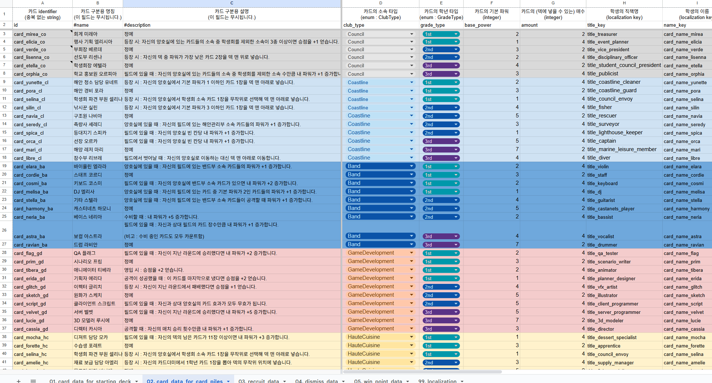
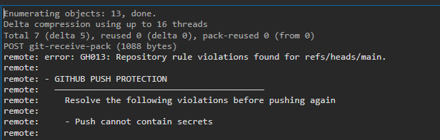
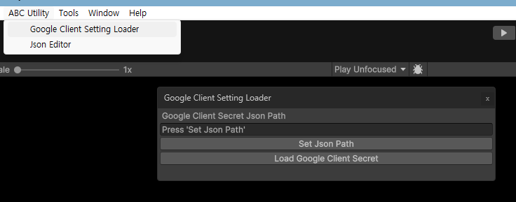
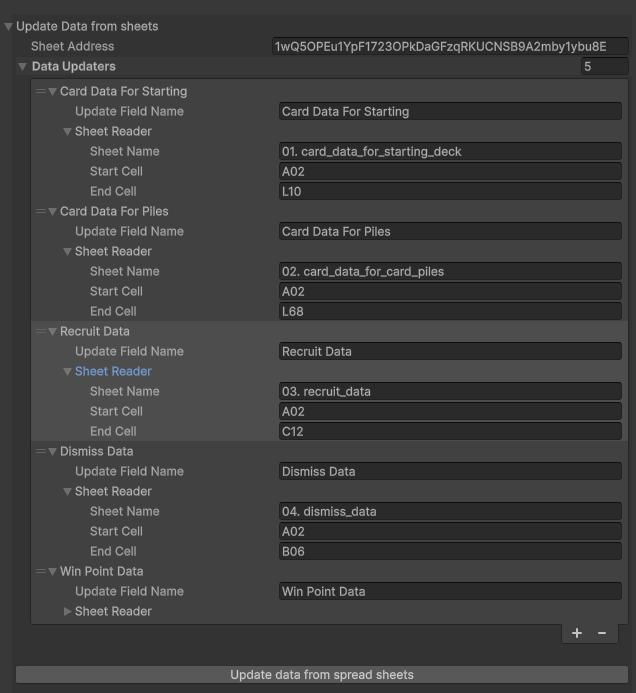
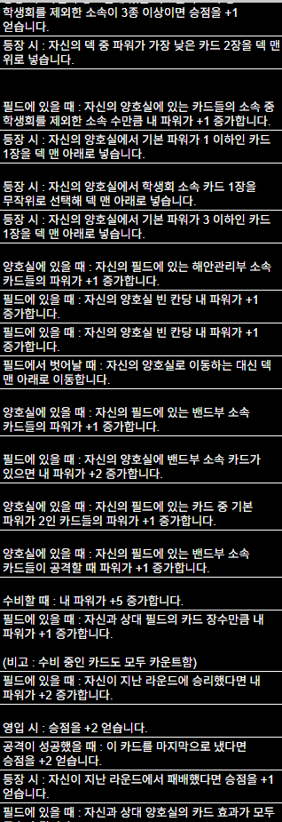
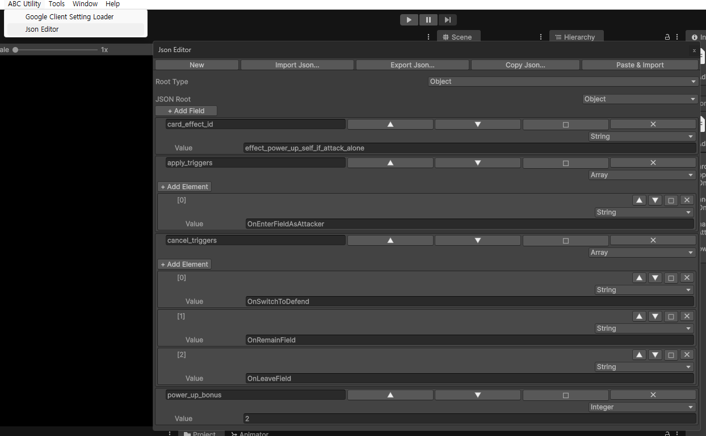

# 🃏 Auto Battle Card Game Clone

인디게임 출품을 위해 참여한 프로젝트 [Afterschool Brawl Club](https://youtu.be/Piy6oe0A7r0?si=3vc8GGXlUzyonj3F)의 기여 부분만 클론한 리포지토리 입니다.  
카드 기반 덱 구성과 자동 전투 시스템을 중심으로, **확장 가능한 게임 구조와 클린한 클라이언트 로직 설계**에 초점을 맞췄습니다.

---

## 📌 프로젝트 개요

- **장르**: 오토 배틀러
- **플랫폼**: PC (Windows)
- **개발 목적**
  - 이하 설계 능력 검증
      - 엔진 레퍼런스에 의존하지 않는 C# (.Net Standard) 만으로 유연한 코어 시스템 설계
      - 기획자 친화적 데이터 직렬화 및 관리
      - 결정론적 시뮬레이션 기반 프레젠테이션 레이어 구현
      - 의존성과 게임 흐름을 고려한 에셋 구조 설계, 관리

> 프로젝트의 기여 부분만 클론하였기 때문에 비주얼적으로 많이 부족할 수 있으나 감안하여 봐주시기 바랍니다.

---

## 🎮 게임 소개

보드 게임 **오토배틀 챌린저스!** 를 참고하여 만든 오토배틀러 카드 게임입니다.  
플레이어는 카드로 덱을 구성하고, 전투가 시작되면 **플레이어 개입 없이 자동으로 전투가 진행**됩니다.

카드의 효과, 순서, 조합에 따라 전투 결과가 달라지며  
라운드를 반복하여 카드를 영입, 제외하며 **전략적인 덱 구성**이 핵심 플레이 요소입니다.

다만 **오토배틀 챌린저스!** 와 다르게 트로피 토큰을 없애고 승점으로 간략화했으며,  
독자적인 카드 효과를 고안해서 구현해보았습니다.

---

## 🕹️ 테스트 방법

1. 현재 리포지토리를 클론해주세요.
2. Unity Hub의 프로젝트 탭에서 `추가` 버튼을 눌러 클론한 리포지토리를 선택해주세요.
   - AutoBattleCardGameClone 프로젝트는 Unity 6000.0.67f1 버전에서 작업했습니다.
3. 프로젝트를 열고 Unity 에디터 화면에서 `Project` 탭에서 `Assets/Scene/Initializer.unity` 씬 인스턴스를 선택해 엽니다.
4. `Play` 버튼을 눌러 즉시 테스트 플레이가 가능합니다.

---

## 🔧 엔지니어링 기술 상세

### 1. 데이터 직렬화 및 관리

동기화 편의성, 정규화 가능 여부에 따라 Google SpreadSheet와 JSON을 채택하였습니다.  

<details>
<summary> 1-1. Google SpreadSheet로부터 데이터 직렬화</summary>



AutoBattleCardGameClone 프로젝트는 카드 및 게임의 환경 구성 및 로컬라이징을 위한 데이터를 관리하기 위한 도구로  
기획자가 쉽게 다룰 수 있고 동기화가 간편한 Google SpreadSheet를 선택하였습니다.

Google SpreadSheet를 직렬화된 데이터로 변환하여 Unity 프로젝트에 적용하기 위해서 Google Cloud와 Google Sheets API 및 [GoogleSheetsToUnity](https://assetstore.unity.com/packages/tools/utilities/google-sheets-to-unity-73410) 에셋 패키지를 활용합니다.



그러나 GoogleSheetsToUnity 에셋 패키지는 SpreadSheet를 불러오기 위해서  
Google Cloud OAuth 클라이언트 ID를 로컬에 저장하도록 설계되어 있으며,  
이는 Github 보안정책에 위배되어 프로젝트 관리에 지장을 받습니다.



이러한 이슈를 방지하기 위해서 [시크릿 로더](Assets/Scripts/Editor/GoogleClientSecretLoader.cs)를 작성하여 시크릿이 저장된 json 파일을 프로젝트 외부에서 읽어오고,  
시크릿을 저장하는 GoogleSheetsToUnity의 설정 파일은 .gitignore에 등록하여 프로젝트 내 시크릿을 저장하지 않는 방식으로  
보안을 유지하며 프로젝트 관리가 가능하도록 하였습니다.



또한 SpreadSheet를 직렬화한 정보를 저장하기 위해 ScriptableObject 기반 [DataAsset](Assets/Scripts/Data/DataAsset.cs) 클래스를 활용하며,  
`DataAsset` 클래스의 상속체는 참조할 SpreadSheet의 이름, 범위등을 지정하기 쉽도록 커스텀 인스펙터를 제공하고 있습니다.  
</details>

<details>

<summary>1-2. JSON을 활용한 카드 효과 데이터 직렬화</summary>

AutoBattleCardGameClone 프로젝트의 카드들은 다양한 카드 효과를 가지고 있습니다.  
각 카드의 효과 로직들이 최대한 코드 수정없이 밸런스를 조정할 수 있도록 데이터 주도 설계 방식을 채택하였습니다.



트리거 조건, 취소 조건, 적용 대상, 여러 수치 파라미터 등 효과마다 필요한 필드 구성이 다르기 때문에  
정규화된 테이블 구조로는 표현하기 어려운 관계로 Google SpreadSheet 대신 JSON을 채택했습니다.

아래 스크립트는 **공격할 때 자신이 필드의 유일한 카드일 경우 자신의 파워가 +2 증가**하는 효과를 가진 카드의 JSON 데이터 입니다.

```json
{
  "card_effect_id": "effect_power_up_self_if_attack_alone",
  "apply_triggers": [
    "OnEnterFieldAsAttacker"
  ],
  "cancel_triggers": [
    "OnSwitchToDefend",
    "OnRemainField",
    "OnLeaveField"
  ],
  "power_up_bonus": 2
}
```



JSON은 개발자에겐 친숙한 포멧이지만, Ide를 사용하지 않는 기획자에게 편집이 어려울 수 있으므로   
커스텀 에디터로 [JSON 편집 툴](Assets/Scripts/Editor/JsonEditor.cs)을 작성하여 프로젝트에서 직관적으로 편집할 수 있도록 돕고 있습니다.
</details>


### 2. 코어 시스템 설계

[ProjectABC.Core 네임스페이스](Assets/Scripts/Core)는 게임의 전반적인 규칙, 시뮬레이션, 카드 효과를 포함하고 있으며
추후 서버 애플리케이션으로 분리할 때를 대비해 순수 C#(.Net Standard)으로 작성되었습니다.

<details>
<summary>2-1. Phase 기반 파이프라인으로 관리되는 게임 진행 흐름</summary>

```pgsql
┌────────────┐
│  UI Layer  │
└─────┬──────┘
      │ Player Input
      ▼
┌───────────────┐
│    IPlayer    │  (Human / AI / Test)
└─────┬─────────┘
      │ PlayerAction
      ▼
┌──────────────────────────────┐
│          Simulation          │
│ ┌───────────┐  ┌───────────┐ │
│ │ GamePhase │→ │ GamePhase │ │
│ └───────────┘  └───────────┘ │
└─────┬────────────────────────┘
      │ change GameState, Publish ContextEvents
      ▼
┌─────────────────────────────┐
│   ContextEventBroadcaster   │
└─────┬───────────────────────┘
      │ ContextEvents
      ▼
┌───────────────────────────┐
│   ContextEventListener    │
└─────┬─────────────────────┘
      │ 
      ▼
   UI / Debug
```

게임 진행은 [Simulation.cs](Assets/Scripts/Core/Simulation.cs) 스크립트에 선언된 Simulation 객체가 IGamePhase를 순차 실행하는 구조로 설계되어 있습니다.  
Phase를 추상화해서 다루기 때문에 다음과 같은 이점을 얻을 수 있습니다.
- 게임의 Phase 단위로 기능 추가 / 교체가 용이
- 특정 Phase만 테스트 가능
- 게임 규칙 변경 시 영향 범위 최소화

</details>

<details>
<summary>2-2. IPlayer, IPlayerAction으로 추상화된 입력과 결과</summary>

```csharp
public interface IPlayer
{
    public string Name { get; }
    public bool IsLocalPlayer { get; }
    
    public Task<IPlayerAction> DeckConstructAsync();
    public Task<IPlayerAction> RecruitCardsAsync(PlayerState myState, RecruitOnRound recruitOnRound);
    public Task<IPlayerAction> DismissCardsAsync(PlayerState myState, DismissOnRound dismissOnRound);
    public Task WaitUntilConfirmToProceed(Type eventType);
}

public interface IPlayerAction
{
    public IPlayer Player { get; }
    public void ApplyState(GameState state);
    public void ApplyContextEvent(SimulationContextEvents events);
    public Task GetWaitConfirmTask();
}
```

[Player.cs](Assets/Scripts/Core/Player.cs) 스크립트에 선언된 `IPlayer`와 `IPlayerAction` 인터페이스 입니다.  

플레이어 입력은 `IPlayer` 인터페이스로 추상화되어 있어 입력 방식과 코어 로직이 완전히 분리될 수 있고,  
로컬 플레이어, AI, 테스트 플레이어 등 모두 동일 인터페이스로 처리할 수 있습니다.  
또한 플레이어 입력에 대한 결과를 모두 비동기로 반환하기 때문에 네트워크 지연이나 사용자 입력 대기를 자연스럽게 처리하고 있습니다.  

플레이어 입력에 대한 결과는 `IPlayerAction` 인터페이스를 사용하고 있으며 Command 패턴을 채용하여,  
이 역시 결합도를 낮추어 유연성과 확장성있는 구조를 유지할 수 있게 했습니다.

</details>

<details>
<summary>2-3. 스냅샷과 이벤트로 시뮬레이션 재현</summary>

MatchPhase에서 자동 전투의 로직은 즉시 완료되지만, 프레젠테이션 측에서는 변경점 단위로 연출을 재생해야 합니다.
이를 위해 시뮬레이션 실행과 프레젠테이션을 분리하고, `MatchSnapshot`과 `IMatchEvent`를 통해 전투 과정을 재구성할 수 있도록 설계했습니다.

#### 이벤트 로그

매치 중 발생하는 모든 상태 변화는 [IMatchEvent](Assets/Scripts/Core/MatchEvent.cs) 인터페이스를 구현한 이벤트 객체로 기록됩니다.

```csharp
public interface IMatchEvent
{
    public void RegisterEvent(IMatchContextEvent matchContextEvent);
}
```

카드 드로우, 공격 성공, 양호실 이동, 버프 적용/해제, 카드 효과 발동 등
매치 중 일어나는 모든 행위가 각각의 이벤트 클래스로 정의되어 `IMatchContextEvent.MatchEvents` 리스트에 순서대로 쌓입니다.

```csharp
public record CardMovementInfo
{
    public readonly CardLocation PreviousLocation;
    public readonly CardLocation CurrentLocation;
}
```

카드의 위치 변화는 [CardLocation](Assets/Scripts/Core/CardLocation.cs)객체가 매치 중 카드의 위치를 기록하여  
이전과 최근 위치를 담은 `CardMovementInfo`객체로 프레젠테이션 측에서 어떤 카드가 어디서 어디로 이동했는지 추적할 수 있습니다.

#### MatchSnapshot

[MatchSnapshot](Assets/Scripts/Core/MatchSnapshot.cs)은 매치의 특정 시점에서 양측의 전체 상태를 객체로 캡처합니다.

```csharp
public class MatchSnapshot
{
    public readonly IReadOnlyDictionary<IPlayer, MatchSideSnapshot> MatchSideSnapShots;
}
```

각 `MatchSideSnapshot`에는 해당 시점의 덱, 필드, 양호실의 카드 목록과 함께
각 카드에 적용된 버프 상태까지 `BuffSnapshot`으로 함께 기록됩니다.

스냅샷은 **매치 시작**(`MatchStartEvent`)과 **포지션 전환**(`SwitchPositionEvent`) 시점에 생성되어
UI가 턴 단위로 전투 상태를 복원하는 기준점 역할을 합니다.

이 구조를 통해 시뮬레이션 코어는 결과만 생성하고, 프레젠테이션 레이어는 기록된 스냅샷과 이벤트를 순차적으로 소비하며 연출을 재생하는 역할 분리가 가능해집니다.

</details>

### 3. 시뮬레이션 레이어 구현

[ProjectABC.Engine 네임스페이스](Assets/Scripts/Engine)는 Core에 대한 의존성을 가지며, 프레젠테이션을 위한 레이어를 구성합니다.

```
Core                                   Engine
─────────────                          ──────────────
Simulation                             Simulator
  └─ IGamePhase 큐 실행                    └─ Simulation 생성 및 실행 관리

IPlayer (인터페이스)                     PlayerController : MonoBehaviour, IPlayer
  └─ Task<IPlayerAction> 반환              └─ UI와 상호작용하여 IPlayerAction 생성

ContextEventBroadcaster.Publish()  →   IContextEventListener<T>.OnEvent()
  └─ 시뮬레이션 결과 이벤트 발행               └─ IConfirmHandler가 연출 트리거
  
MatchContextEvent : IContextEvent  →   MatchEventRunner : IConfirmHandler<MatchContextEvent>
  └─ 시뮬레이션 이벤트 중 매치 내역 전달        └─ 매치 이벤트를 받고 IMatchEvent 리스트를 소비, 연출
```

<details>
<summary>3-1. 이벤트 소싱 기반 매치 시각화</summary>

매치 시뮬레이션의 결과는 `IMatchEvent` 리스트로 기록됩니다.   
Engine 레이어에서는 이 리스트를 순차적으로 소비하며 시각화 연출을 수행합니다.   

[MatchEventRunner](Assets/Scripts/Engine/MatchEventRunner.cs)는 `IConfirmHandler<MatchContextEvent>`를 구현하여 시뮬레이션 이벤트를 수신하고,  
`Dictionary<Type, IMatchEventProcessor>` 타입 별 디스패치로 각 이벤트를 대응하는 프로세서에 위임합니다.

```csharp
// MatchEventRunner.cs — 이벤트 순차 소비 루프
while (!_cts.IsCancellationRequested && _eventIndex < _matchEvents.Count)
{
    var matchEvent = _matchEvents[_eventIndex++];
    if (!_matchEventProcessors.TryGetValue(matchEvent.GetType(), out var processor))
    {
        throw new KeyNotFoundException($"No processor for {matchEvent.GetType()}");
    }

    await processor.ProcessEventAsync(matchEvent, _cts.Token);
}
```

[MatchEventProcessor<T>](Assets/Scripts/Engine/MatchEventProcessor/MatchEventProcessor.cs)는 제네릭 추상 클래스로, 타입 캐스팅을 내부에서 처리하며, 각 프로세서 구현체가 구체적인 이벤트 타입만 다루도록 하였습니다.  

```csharp
public abstract class MatchEventProcessor<T> : IMatchEventProcessor where T : IMatchEvent
{
    public abstract Task ProcessEventAsync(T matchEvent, CancellationToken token);

    public async Task ProcessEventAsync(IMatchEvent matchEvent, CancellationToken token)
    {
        await ProcessEventAsync((T)matchEvent, token);
    }
}
```

새로운 이벤트 타입이 추가될 때 대응하는 프로세서만 구현하면 되기 때문에 확장이 용이합니다.

</details>

<details>
<summary>3-2. 시뮬레이션 타임 스케일 시스템</summary>

완료된 매치 로직을 프레젠테이션이 연출하는 본 게임의 특성상 편의 기능으로 배속 재생, 일시정지 등의 기획적 요구사항이 있었고  
이에 대응하기 위해 프레젠테이션 레이어에만 영향을 주는 타임스케일 시스템을 별도로 구현하였습니다.  
(Unity의 `Time.timeScale`은 전역에 영향을 주기 때문)  

[MatchSimulationTimeScaler](Assets/Scripts/Engine/MatchSimulationTimeScaler.cs) 싱글턴 클래스는 시뮬레이션 배속과 일시정지 상태를 관리합니다.  
`ScaledTime` 구조체는 기본 배속 (1.0배) 단위 기준 초 단위 시간을 나타내며,  
`MatchSimulationTimeScaler`에 지정된 시뮬레이션 배속에 따라 시뮬레이션 시간을 `implicit operator float` 함수를 통해 실제 시간으로 변환하여 반환합니다.  

```csharp
[Serializable]
public struct ScaledTime
{
    public float time;

    public ScaledTime(float time)
    {
        this.time = time;
    }
    
    public static ScaledTime Zero => new ScaledTime(0.0f);
    
    public static implicit operator ScaledTime(float time) => new ScaledTime(time);

    public static implicit operator float(ScaledTime scaledTime)
    {
        MatchSimulationTimeScaler timeScaler = MatchSimulationTimeScaler.CreateInstance();
        float value = timeScaler.GetScaledTime(scaledTime.time);

        return value;
    }

    public Task WaitScaledTimeAsync(CancellationToken token = default)
    {
        return MatchSimulationTimeScaler.WaitScaledTimeAsync(time, token);
    }
}
```

</details>


### 4. 에셋 바인딩 구조 설계

에셋 로딩은 전적으로 Addressables를 사용하지만, 게임 흐름에 따라 라이프 사이클을 관리할 수 있도록
씬 단위 로딩이 이루어질 때 [SceneLoader](Assets/Scripts/Engine/SceneLoader.cs) 클래스가 멤버로 들고있는 [SceneLoadingProfileAsset](Assets/Scripts/Data/SceneLoadingProfileAsset.cs) 객체(abstract, ScriptableObject)를 이용하여 에셋의 라이프 사이클을 관리합니다.

<details>
<summary>4-1. 씬 단위 에셋 바인딩</summary>

`SceneLoadingProfileAsset`은 인스펙터에 사용할 에셋 레퍼런스를 3가지로 등록하여 관리하므로, postload를 통해 백그라운드 로딩을 이용하여 체감 속도를 개선할 수 있습니다.
- 씬 전환 전 로딩할 에셋 레퍼런스(preload) → `assetRefsForPreload`
- 씬 레퍼런스 → `ActivateSceneAsync()`
- 씬 활성화 후 백그라운드 로드할 에셋 레퍼런스(postload) → `assetRefsForPostLoad`

`SceneLoadingProfileAsset`은 `LoadSceneAndAssetsAsync()`가 호출될 때 `AsyncOperationHandle`을 바인딩하고,  
`UnloadSceneAndAssetsAsync()`가 호출 될 때 바인딩됐던 핸들을 `Release()`하여 명시적으로 관리하고 있습니다.

씬을 SceneList에 등록하지 않고 Addressables를 통해 로드하기 때문에 씬을 변경해서 빌드를 배포하는 경우에도 Standalone 빌드가 아닐 경우 씬이 포함된 에셋번들만 재배포하는 형태로 빌드 수정이 가능하며,  
같은 씬을 로드하더라도 다른 에셋 구성이 필요한 경우 (ex. 일반게임 ↔ 튜토리얼)에도 인스펙터에 다른 에셋 레퍼런스를 등록하는 방식으로 간단하게 대응이 가능합니다.

또한 `SceneLoadingProfileAsset`은 추상 클래스이므로 주요 메소드를 오버라이드해서 씬 별 커스텀 로직으로 확장도 가능합니다.

</details>

<details>
<summary>4-2. 전역 에셋 바인딩 및 특정 타입 에셋 관리</summary>

SpriteAtlas를 품질 설정에 따라 적절한 화질의 Variant Atlas를 사용하도록 하기 위해, 언어 설정에 따라 TMP_Font의 fallback 테이블을 구성하기 위해 각 SpriteAtlas 및 TMP_Font 에셋은 전역 관리 클래스를 따로 채용하고 있습니다.  
`AtlasBinder`와 `FontBinder`가 각각 SpriteAtlas와 TMP_Font 에셋을 전역으로 관리하고 있습니다.  

해당 클래스들은 `IAssetBinder<T>` 인터페이스를 구현하여 동일한 바인딩 패턴을 공유합니다.  
로딩 중인 에셋을 해제하는 등의 레이스 컨디션을 방지하기 위해 `AssetHandleSchedule` 객체를 큐로 관리하며 하나씩 순서대로 처리합니다.

```csharp
// IAssetBinder.cs

public abstract class AssetHandleSchedule<T> where T : IAssetBindEntry, IEquatable<T>
{
    public virtual bool Precondition(IAssetBinder<T> assetBinder) => true;
    public abstract void Run(IAssetBinder<T> assetBinder);
}

public sealed class AssetBindSchedule<T> : AssetHandleSchedule<T> where T : IAssetBindEntry, IEquatable<T>
{
    private readonly List<T> _entries = new List<T>();
    
    public AssetBindSchedule(T entry)
    {
        _entries.Add(entry);
    }

    public AssetBindSchedule(IList<T> entries)
    {
        _entries.AddRange(entries);
    }
    
    public override void Run(IAssetBinder<T> assetBinder)
    {
        foreach (var entry in _entries)
        {
            assetBinder.BindAsset(entry);
        }
    }
}

public sealed class AssetReleaseSchedule<T> : AssetHandleSchedule<T> where T : IAssetBindEntry, IEquatable<T>
{
    private readonly List<T> _entries = new List<T>();
    
    public AssetReleaseSchedule(T entry)
    {
        _entries.Add(entry);
    }

    public AssetReleaseSchedule(IList<T> entries)
    {
        _entries.AddRange(entries);
    }

    public override bool Precondition(IAssetBinder<T> assetBinder)
    {
        return _entries.All(IsHandleLoaded);
        
        bool IsHandleLoaded(T entry)
        {
            return assetBinder.TryGetBindingHandle(entry, out var handle)
                   && IAssetBinder.CheckHandleLoaded(handle);
        }
    }

    public override void Run(IAssetBinder<T> assetBinder)
    {
        foreach (var entry in _entries)
        {
            assetBinder.ReleaseAsset(entry);
        }
    }
}
```

`AtlasBinder`는 SpriteAtlas를 전역적으로 관리할 뿐만 아니라, 품질 설정 (`AtlasQuality`)에 따라 `AtlasIdentifier` 객체를 통해 사용할 에셋의 Addressable Name을 자동으로 계산하여 해당하는 Variant Atlas를 로드합니다.  
또한, 바인딩 중인 Atlas의 핸들을 이용해 SpriteAtlasManager.atlasRequested 이벤트를 처리합니다. 즉 Atlas의 Late Binding을 지원합니다.

```csharp
public sealed class AtlasBinder : MonoBehaviour, IAssetBinder<AtlasBindingEntry>
{
    // ...
    
    private void OnEnable()
    {
        SpriteAtlasManager.atlasRequested += OnAtlasRequested;
    }

    private void OnDisable()
    {
        SpriteAtlasManager.atlasRequested -= OnAtlasRequested;
    }
    
    // ...
    
    private void OnAtlasRequested(string addressableName, Action<SpriteAtlas> callback)
    {
        AtlasIdentifier requested = new AtlasIdentifier(addressableName);
        if (requested.QualitySuffix != AtlasQuality.None && requested.QualitySuffix != CurrentQualitySetting)
        {
            Debug.Log($"{nameof(AtlasBinder)} : AtlasManager requested '{addressableName}', but ignored because of not matched with CurrentQualitySetting ({CurrentQualitySetting})");
        }
        
        // Debug.Log($"{nameof(AtlasBinder)} : Atlas requested... '{addressableName}' / identifier  '{requested.AtlasName}' + suffix '{requested.QualitySuffix}'");
        
        if (_atlasHandles.TryGetValue(requested, out var atlasHandle) && atlasHandle.IsValid())
        {
            if (atlasHandle.Status == AsyncOperationStatus.Succeeded)
            {
                OnLoadHandleCompleted(atlasHandle);
            }
            else if (!atlasHandle.IsDone)
            {
                atlasHandle.Completed += OnLoadHandleCompleted;
            }
            
            return;
        }

        var handle = Addressables.LoadAssetAsync<SpriteAtlas>(addressableName);
        handle.Completed += ReleaseVariantOnCompleted;
        handle.Completed += OnLoadHandleCompleted;
        
        _atlasHandles.Add(requested, handle);
        return;
        
        void OnLoadHandleCompleted(AsyncOperationHandle<SpriteAtlas> completeHandle)
        {
            callback?.Invoke(completeHandle.Result);
        }
    }
    
    // ...
}
```

`FontBinder`는 세 가지 언어(`KR`, `EN`, `JP`)를 지원하는 기획적 요구사항을 충족하기 위해, TMP_Font 에셋을 전역적으로 관리하는 동시에 다음 작업들을 수행합니다.  

1. 기본 폰트 (`EN`)의 런타임 클론 생성   
   - 영문 폰트는 모든 언어 설정에서 공용으로 사용하며 언어 설정에 따라 FallbackFontTable을 설정합니다.
   - 이 때, `TMP_Font` 에셋은 ScriptableObject이며, 런타임에 가한 수정이 영구히 남기 때문에 문제가 발생할 수 있습니다.

따라서 원본 폰트를 보호하기 위해 `Instantiate()`로 클론 폰트를 생성한 뒤 `FontBinder`내에서 명시적으로 관리합니다.

```csharp
// FontBinder.cs

private void BindBasicFonts()
{
    foreach (string basicFontAddressableName in basicFontAddressableNames)
    {
        if (_basicFontHandles.ContainsKey(basicFontAddressableName))
        {
            Debug.LogWarning($"{nameof(FontBinder)} : {basicFontAddressableName} already bind..");
            continue;
        }
        
        var handle = Addressables.LoadAssetAsync<TMP_FontAsset>(basicFontAddressableName);
        handle.Completed += CloneBasicFontsOnCompleted;
        
        _basicFontHandles.Add(basicFontAddressableName, handle);
    }
}

private void CloneBasicFontsOnCompleted(AsyncOperationHandle<TMP_FontAsset> handle)
{
    TMP_FontAsset originFont = handle.Result;

    if (_cloneMap.TryGetValue(originFont, out TMP_FontAsset clone) && clone != null)
    {
        Debug.Log($"{nameof(FontBinder)} : {originFont.name} has already been bind");
        return;
    }
    
    clone = Instantiate(originFont);
    clone.name = originFont.name + " (Runtime)";
    clone.hideFlags = HideFlags.DontSave | HideFlags.DontSaveInEditor;
        
    _cloneMap[originFont] = clone;
}
```

2. 로케일 별 Additive 폰트 분리 관리
   - 영문 이외 로케일이 대상인 폰트 (`KR`, `JP`)는 현재 로케일 설정과 같은 것만 바인딩, 로드합니다.
   - TMP_Text 컴포넌트에서 로케일 텍스트를 정상적으로 표시하기 위해 클론된 기본 EN 폰트의 FallbackFontTable에 등록합니다.

```csharp
// FontBinder.cs

public void BindAsset(AdditiveFontBindingEntry entry)
{
    if (_additiveFontHandles.ContainsKey(entry.fontAddressableName))
    {
        Debug.LogWarning($"{nameof(FontBinder)} : {entry.fontAddressableName} is already bind");
        return;
    }

    var handle = Addressables.LoadAssetAsync<TMP_FontAsset>(entry.fontAddressableName);
    handle.Completed += RegisterFallbackFontTableOnCompleted;
    
    _additiveFontHandles.Add(entry.fontAddressableName, handle);
}

private void RegisterFallbackFontTableOnCompleted(AsyncOperationHandle<TMP_FontAsset> handle)
{
    TMP_FontAsset fallbackFont = handle.Result;
    fallbackFont.ReadFontAssetDefinition();
    // Debug.Log($"{nameof(FontBinder)} : register fallback '{fallbackFont.name}'");

    foreach (var clonedBaseFont in _cloneMap.Values)
    {
        if (clonedBaseFont.fallbackFontAssetTable.Contains(fallbackFont))
        {
            continue;
        }
        
        clonedBaseFont.fallbackFontAssetTable.Add(fallbackFont);
        clonedBaseFont.ReadFontAssetDefinition();
    }
}
```

</details>

---

## 🧠 추후 개선할 부분

### 1. 결정론적 RNG 필요

추후 시뮬레이션의 재현이 필요해질 여지가 있으나 C# System.Random은 내부 구현이 바뀐 적이 있고, UnityEngine.Random은 같은 시드에 대해 재현성이 보장되지 않습니다.
따라서 시드 기반 RNG 라이브러리가 별도로 적용하여 동일 입력에 대한 재현을 보장할 필요가 있습니다.

### 2. CardEffectFactory의 스위치문 확장성

```csharp
// CardEffectFactory.cs

switch (effectId)
{
    case "effect_elite":
        return new EliteCardEffect(card, data);
    case "effect_move_specific_grade_cards_from_piles_to_deck":
        return new MoveSpecificGradeCardsFromPilesToDeck(card, data);
    case "effect_power_up_self_as_both_side_field_amount":
        return new PowerUpSelfAsBothSideFieldAmount(card, data);
    // ...
```

`CardEffectFactory`객체는 카드효과가 추가될 때 마다 팩토리 코드를 직접 수정해야 하는 구조를 가지고 있습니다.  
팩토리가 모든 타입을 알고 있는게 아닌, `CardEffect` 객체 자신이 id와 생성방법을 팩토리에 등록하는 레지스트리 패턴을 채용하여 확장성을 확보할 수 있는 여지가 있습니다.

---


## 📎 참고

본 리포지토리는 학습 및 포트폴리오 목적의 **클론 프로젝트**이며, 모든 스크립트는 모두 본인 [verdantray](https://github.com/verdantray)가 작성하였습니다.  
프로젝트에 포함된 리소스 중 교실, 책상 3d 모델 에셋은 [suiren22](https://github.com/suiren22)님이 제공해주셨습니다.